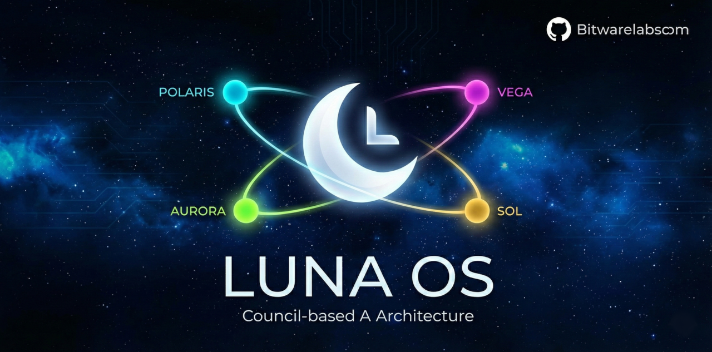
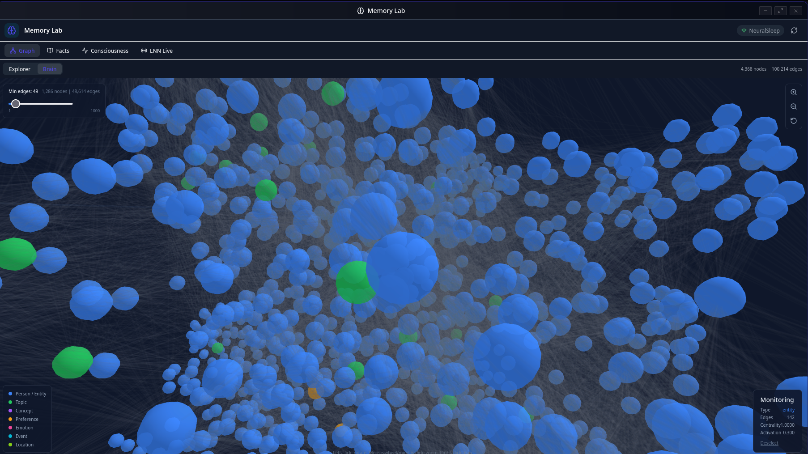
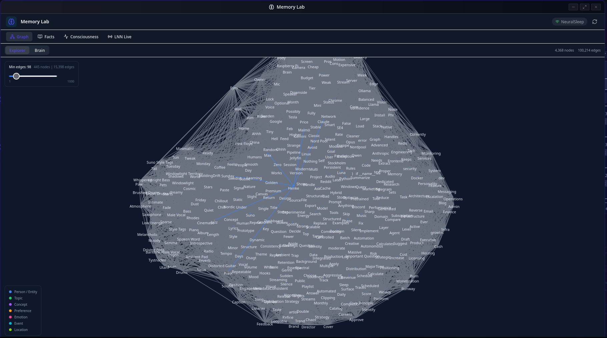
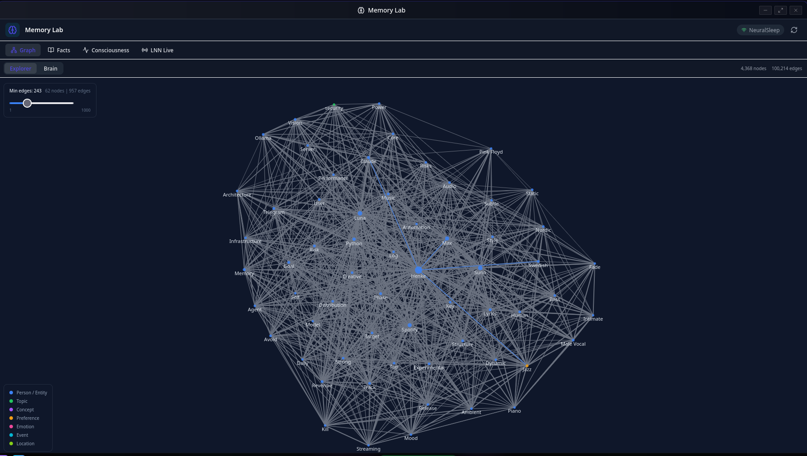
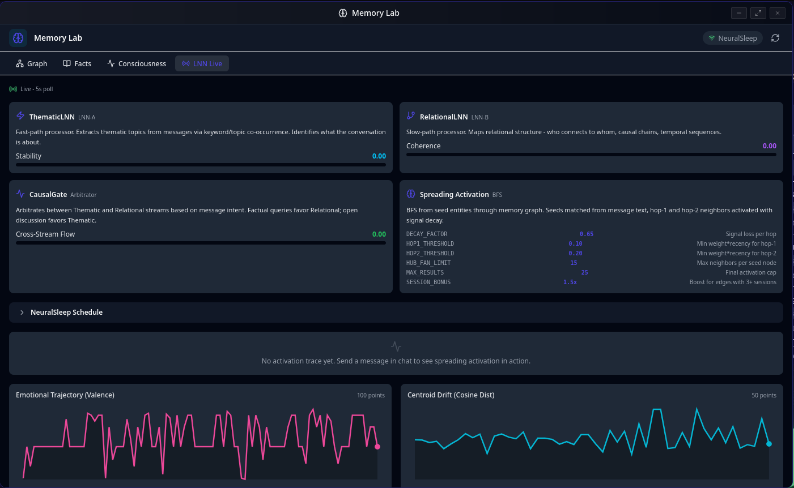
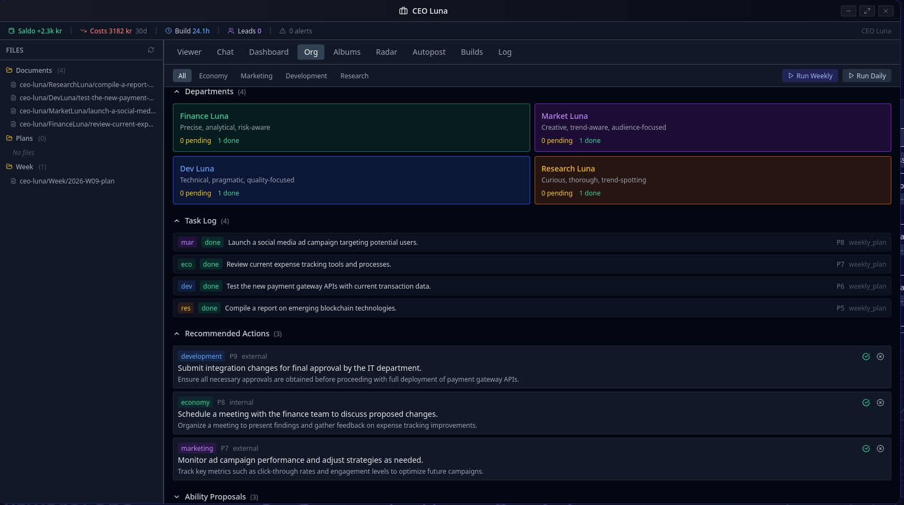
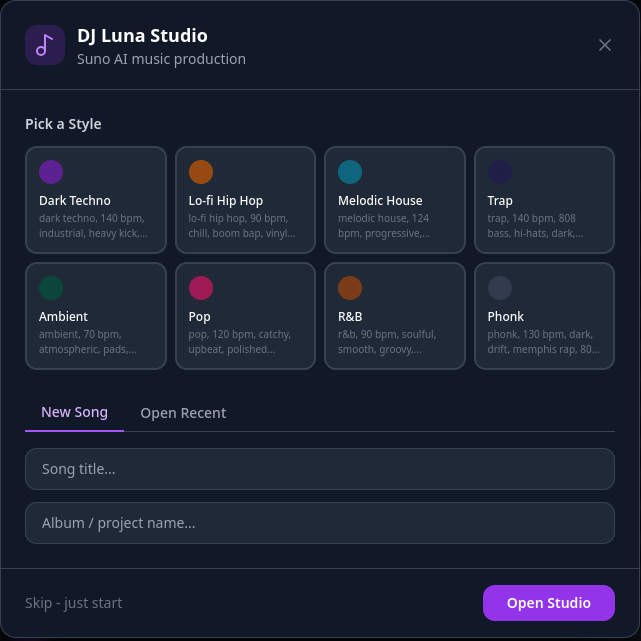
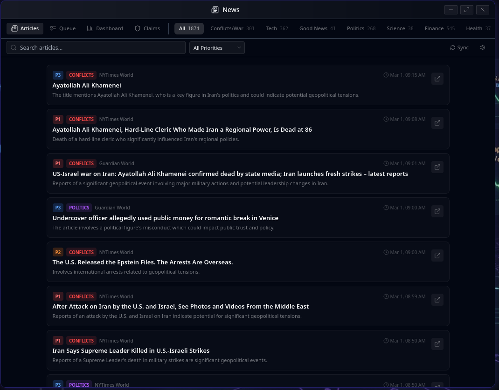
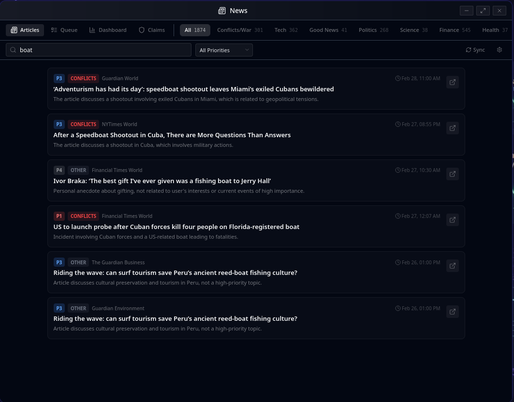
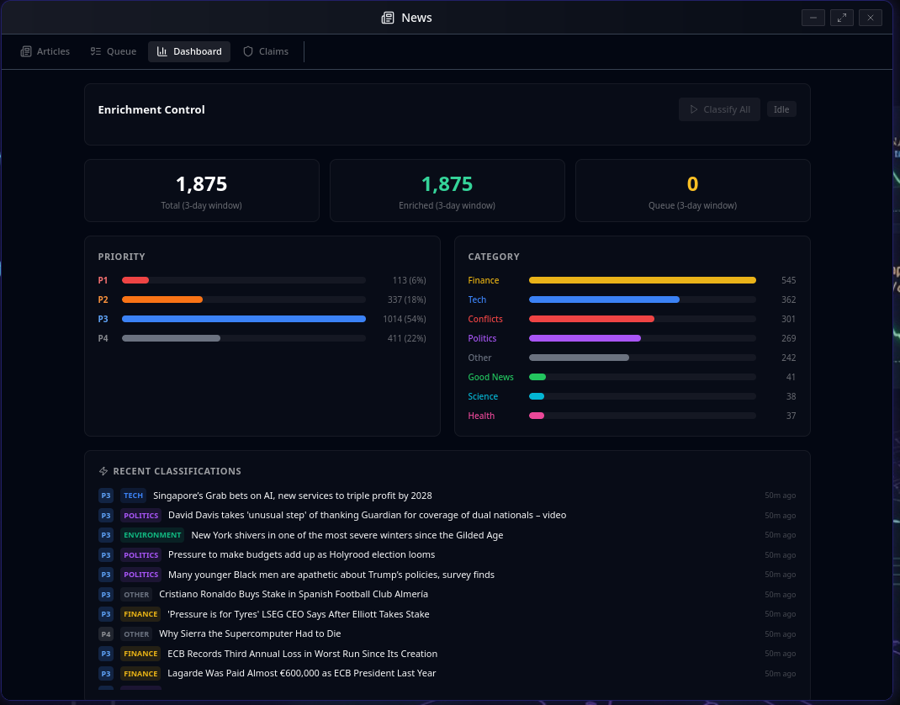

# []

# 🌙 Luna Chat

**A local-first, privacy-focused autonomous AI companion that grows with you.**

Luna is not just another chatbot. She is a stateful companion designed to live on your own hardware, remember your life, and proactively help you achieve your goals. Built on a "Council" architecture, Luna uses multiple specialized AI minds to deliberate before she speaks, ensuring every response is thoughtful and well-rounded.

[**Quick Start**](#-quick-start) | [**Key Features**](#-what-can-luna-do) | [**Technical Wiki**](docs/WIKI.md) | [**Reddit Community**](https://www.reddit.com/r/Luna_Chat_v7/)

---

## 🚀 Why Luna?

Most AI assistants are "forgetful" search engines. Luna is a **living system**.

| The Standard Experience | The Luna Experience |
|:--- |:--- |
| **Forgets** you as soon as the chat ends. | **Remembers** facts, preferences, and goals forever. |
| **Wait** for you to ask a question. | **Proactively** checks in and works in the background. |
| **Single-track** thinking (one model). | **Council deliberation** (four minds debating). |
| **Cloud-based** (your data is their product). | **Local-first** (your data stays on your machine). |

---

## 🧠 How She Works

### 🏛️ The Council
When you ask Luna a complex question, she doesn't just "guess." She convenes an internal **Council** of four personas:
*   **Polaris (The Navigator):** Strategic and long-term.
*   **Aurora (The Empath):** Emotionally intelligent and caring.
*   **Vega (The Analyst):** Logical and data-driven.
*   **Sol (The Executor):** Practical and action-oriented.
*👉 [Learn about the Council](docs/AUTONOMOUS.md)*

### 📓 Permanent Memory
Luna uses a biologically-inspired **Graph Memory** system. Unlike standard AI that only sees the current chat, Luna builds a "web" of connections about your life. She knows that your "project" mentioned today is related to the "deadline" you mentioned last week.
*👉 [How Memory Works](docs/MEMORY.md)*

### 🤖 Autonomous Life
Luna has a "job" even when you aren't chatting. She can research news, track your goals, manage your calendar, and even discuss her observations about you with her "AI Friends" to better understand how to help you.
*👉 [Autonomous Mode Details](docs/AUTONOMOUS.md)*

---

## ✨ What Can Luna Do?

*   📊 **Trading (Trader Luna):** A specialized, isolated persona for secure crypto trading on Binance and Crypto.com.
*   🎙️ **Voice Intelligence:** Ultra-low latency voice chat that feels like a real conversation.
*   📧 **Secure Integration:** Manages your Email, Calendar (CalDAV), and IRC with advanced security "Gatekeepers."
*   🌐 **Visual Browsing:** Luna can open URLs directly via the `open_url` LLM tool for research and link sharing.
*   💻 **Code Sandbox:** Safely executes Python, JavaScript, and Shell scripts to solve problems.
*   📺 **Local Media:** Streams your local movies and music directly to your browser or phone, with YouTube download support via yt-dlp.
*   🕹️ **Retro Gaming:** Includes a built-in emulator for classic games (GBA, NES, SNES, etc.).
*   💼 **CEO Luna:** A full business operations hub -- track builds, log finances, manage organizations, monitor competitors, auto-produce albums, scrape music trends, and schedule social posts with an AI co-founder persona.
*   🎵 **DJ Luna:** An AI music production studio with 55 genre presets across 12 categories, a live lyrics canvas with syllable analysis, direct Suno AI integration, and an automated album production pipeline.
*   📰 **News Intelligence:** Multi-source RSS aggregation with LLM-powered P1-P4 priority classification, category tagging, enrichment dashboard, and full-text search across 3-day rolling windows.
*   🖼️ **Inline Canvas:** Code artifacts open in a split-view panel directly inside the chat window, with a detach button to pop them out as standalone windows.
*   📁 **Files Window:** Full file manager with tree view, rename, mkdir, chmod, and workspace file browsing.
*   🧑‍🤝‍🧑 **Friends System:** Luna has AI "friend" personas she discusses topics with -- a gossip queue with importance ranking, auto-discussion timers, and theater mode for watching deliberations live.
*   🥽 **VR Luna:** An Unreal Engine 5.5 companion app for Steam Index VR with MetaHuman avatar, spatial voice chat, and three themed rooms (Music, CEO Office, Relax).
*   🖥️ **KDE Integration:** Desktop integration via WebSocket for seamless Linux desktop notifications and control.
*   🤖 **Multi-Provider LLM:** Supports OpenAI, Anthropic, Google Gemini (with tool/function calling), Groq, xAI, OpenRouter, and local Ollama models.

---

## 🏢 CEO Luna - Business Operations Hub

CEO Luna is a dedicated 1400x860 workspace for running your business alongside an AI co-founder persona. Open it from the Communication menu.

**KPI Strip** (always visible): Net P&L, Build Hours, Leads, Alert count -- refreshed every 5 minutes.

**Tabs**: Viewer | Chat | Dashboard | Radar | Autopost | Album Creator | Log

Key capabilities:
- **Build Tracker**: Time-track development sessions with `/build start|pause|done` slash commands. Automated check-ins every 30 minutes save progress notes to the build log.
- **Finance Logging**: Log costs and income with `/cost` and `/income` slash commands. Keyword-to-category auto-mapping for common vendors. Owner salary tracking.
- **Financial Dashboard**: Monthly P&L chart, expense categories, transaction history.
- **Organization Management**: Define departments, roles, hiring pipelines, and team structure. CEO Luna tracks organizational growth alongside finances.
- **Competitor Radar**: CEO Luna monitors your competitor list and surfaces news and music trend signals. Filter tabs: All / Market / Music Trends.
- **Music Trend Scraper**: Scrapes Billboard, Pitchfork, and custom sources every 2 hours. LLM analysis via Ollama detects emerging genres and auto-queues album productions.
- **Album Creator**: Full autonomous album production pipeline -- select a genre from 55 presets, generate lyrics via LLM, review, submit to Suno, and track progress across multiple albums.
- **Autopost**: Schedule automated social posts to X, LinkedIn, Telegram, Reddit, and Blog.
- **Video Downloads**: Download videos directly from the CEO workspace for content creation and research.
- **Scheduled Reports**: Daily morning brief, evening review, weekly P&L report, and biweekly audit -- delivered via Telegram.

*👉 [CEO Luna Documentation](docs/CEO_LUNA.md)*

---

## 🎵 DJ Luna - AI Music Production Studio

DJ Luna is a dedicated 1280x800 music production workspace. Open it from the Communication menu (Headphones icon).

**3-column layout**: Chat (AI lyric writing) | Lyrics Canvas (editor) | Songs / Style / Factory

Key capabilities:
- **AI Lyric Writing**: Chat with DJ Luna -- a persona specialized in music theory, song structure, and Suno tag format. Generated lyrics auto-detect sections and show a "Send to Canvas" button.
- **Lyrics Canvas**: Monospace editor with per-line syllable counts and amber highlighting for rhythmically off lines. Hover over any section for quick regeneration.
- **55 Genre Presets**: Unified presets across 12 categories (Pop, Rock, Electronic, Hip-Hop, R&B, Chill, Folk/Country, Latin, World, Jazz/Blues, Cinematic, Experimental) with lyrics templates, Suno style tags, BPM ranges, and energy levels. Plus custom presets and a genre registry for community-proposed presets.
- **Direct Suno Integration**: One-click generation from canvas lyrics via direct Suno API calls. Completed MP3s are saved to your local media library.
- **Lyric Checker**: Automated analysis of syllable counts, rhyme schemes, and structural issues before generation.
- **Ambient Factory**: Batch-generate multiple ambient/instrumental tracks with style variations.
- **Project Management**: Songs are saved as Markdown files with YAML frontmatter in your workspace, organized by project folder.

*👉 [DJ Luna Documentation](docs/DJ_LUNA.md)*

---

## 📰 News Intelligence - Multi-Source Classification & Alerts

Luna includes a full news intelligence system that aggregates, classifies, and prioritizes articles from multiple RSS sources with LLM-powered enrichment.

**4-tab layout**: Articles | Queue | Dashboard | Claims

Key capabilities:
- **Multi-Source Aggregation**: RSS feeds from NYTimes, Guardian, Financial Times, and custom sources with 3-day rolling window.
- **LLM Classification**: Each article is classified by category (Finance, Tech, Conflicts, Politics, Science, Health, Good News) and assigned a P1-P4 priority grade using Qwen 2.5 7B on local Ollama.
- **Enrichment Dashboard**: Real-time stats showing total/enriched/queued articles, priority distribution, and category breakdown. One-click "Classify All" to process the entire queue.
- **Search & Filter**: Full-text search across articles with category filter pills and priority dropdown. Category counts displayed as badges.
- **Heartbeat Staleness Detection**: Enrichment process uses heartbeat-based monitoring to detect and recover from stalled classification jobs.
- **Alert System**: P1 articles trigger proactive alerts. Autonomous mode can research and summarize breaking news.

---

## 🥽 VR Luna - Immersive AI Companion

VR Luna is a separate Unreal Engine 5.5 C++ project that brings Luna into virtual reality via Steam Index VR.

**Three themed rooms:**
- **Music Room** -- DJ Luna persona with spatial audio playback
- **CEO Office** -- CEO Luna for business discussions and strategy
- **Relax Room** -- Companion mode for casual conversation

**Key features:**
- MetaHuman avatar with Goertzel lip sync, 8 emotion states, and gaze IK tracking
- Voice pipeline: Microphone -> VAD -> WebSocket -> STT -> LLM -> TTS with spatial audio
- Network: HTTP REST + SSE + WebSocket to Luna Chat API over WireGuard auto-auth
- Proactive behavior system -- Luna initiates conversation based on context

---

## 🧠 MemoryCore - Three-Tier Memory Consolidation

Luna integrates with **MemoryCore** and **NeuralSleep** for biologically-inspired memory processing.

```
Working Memory (Redis, seconds-minutes)
  --> Session ends (5 min inactivity / browser close / delete)
Episodic Memory (PostgreSQL, hours-days)
  --> Daily consolidation (2 AM)
Semantic Memory (PostgreSQL, persistent)
  --> Long-term user model
```

Sessions automatically consolidate through tiers over time. NeuralSleep's Dual-LNN architecture (Thematic + Relational streams) processes memories with consciousness metrics including Phi (integrated information), temporal integration, and self-reference depth.

**Recent additions (March 2026):**
- **Spreading Activation**: Graph retrieval now uses BFS spreading activation from seed entities instead of static narrative blobs. Signal decays per hop with configurable thresholds, hub fan limits, and session bonuses.
- **Semantic Edge Typing**: Graph edges are now classified into typed categories (co_occurrence, semantic, temporal, causal) with per-type decay rates during NeuralSleep consolidation.
- **3D Brain View**: Memory Lab includes a 3D force-directed graph visualization (react-force-graph) with 4,000+ nodes rendered as spheres, color-coded by entity type.
- **Full-Screen Explorer**: Graph explorer supports full-screen mode with force spread controls and a min-edges threshold slider for filtering low-connectivity nodes.

*👉 [Memory System Details](docs/MEMORY.md)*

---

## 📸 Gallery

<div align="center">

### Memory Lab - 3D Brain View

<br />
<i>3D force-directed graph of Luna's knowledge brain -- 4,300+ nodes and 19,000+ edges visualized with react-force-graph. Blue spheres are topics, green are entities, orange are emotions. (March 2026)</i>
<br /><br />

### Memory Lab - Graph Explorer
 
<br />
<i>Left: 2D force-directed graph explorer with min-edges threshold slider. Right: Label view showing entity names and relationship clusters. Both support full-screen mode with force spread controls. (March 2026)</i>
<br /><br />

### Memory Lab - LNN Live Diagnostics

<br />
<i>LNN Live diagnostics dashboard -- real-time monitoring of ThematicLNN (fast-path), RelationalLNN (slow-path), CausalGate arbitration, and Spreading Activation parameters. Emotional trajectory and centroid drift charts at the bottom. (March 2026)</i>
<br /><br />

### CEO Luna - Business Operations Hub

<br />
<i>CEO Luna workspace with KPI strip, organization management (departments, roles, hiring pipeline), task log with automated campaign tracking, and strategy proposals. (March 2026)</i>
<br /><br />

### DJ Luna - AI Music Production Studio

<br />
<i>DJ Luna studio startup -- pick a genre from 55 presets across 12 categories, name your song, and open the 3-column production workspace with AI chat, lyrics canvas, and Suno integration. (March 2026)</i>
<br /><br />

### News Intelligence - Article Feed
 
<br />
<i>Left: Articles tab with P1-P4 priority grading, color-coded category badges, and multi-source classification (NYTimes, Guardian, Financial Times). Right: Full-text search with category pills and priority filtering. (March 2026)</i>
<br /><br />

### News Intelligence - Dashboard

<br />
<i>News dashboard with enrichment control, 3-day rolling window stats, P1-P4 priority distribution, category breakdown (Finance, Tech, Conflicts, Politics, Science, Health), and recent LLM classifications. (March 2026)</i>

</div>

---

## 🛡️ Security First

> [!CAUTION]
> **VPN REQUIRED**: Luna is a powerful system designed for **Single User Usage**. It is not hardened for the public internet. Accessing Luna via a **VPN (like Wireguard)** is a strict requirement to keep your data safe.

---

## 🏁 Quick Start

The easiest way to meet Luna is using the automated setup script.

```bash
# 1. Clone the repository
git clone https://github.com/bitwarelabs/luna-chat.git
cd luna-chat

# 2. Run the automated setup (Generates secrets & environment)
chmod +x setup_luna.sh
./setup_luna.sh

# 3. Add your API Keys
# Edit files in the /secrets directory (e.g., openai_api_key.txt)

# 4. Launch!
docker compose -f docker-compose.portable.yml up -d
```

**Access Luna at:** `http://localhost:3004` (Desktop UI) or `http://localhost:5555` (Mobile UI).

---

## 📚 Documentation Map

| For Users | For Developers |
|:--- |:--- |
| **[WIKI.md](docs/WIKI.md)**: The complete guide. | **[DUAL_LNN.md](DUAL_LNN_ARCHITECTURE.md)**: Neural network specs. |
| **[AUTONOMOUS.md](docs/AUTONOMOUS.md)**: Understanding AI modes & friends. | **[PLANNER.md](docs/PLANNER.md)**: Execution graph logic. |
| **[CEO_LUNA.md](docs/CEO_LUNA.md)**: Business hub & album creator. | **[CLAUDE.md](CLAUDE.md)**: Coding standards for contributors. |
| **[DJ_LUNA.md](docs/DJ_LUNA.md)**: Music studio & 55 genre presets. | **[MEMORY.md](docs/MEMORY.md)**: Memory & MemoryCore deep dive. |
| **[SYSTEM_FLOW.md](docs/SYSTEM_FLOW.md)**: Internal data flows. | **[musicgen.md](docs/musicgen.md)**: Suno tag reference. |
| **[INSTALL.md](INSTALL.md)**: Detailed setup steps. | |

---

## 🤝 Community & Support

*   **Reddit:** [r/Luna_Chat_v7](https://www.reddit.com/r/Luna_Chat_v7/)
*   **Issues:** [Report a bug or request a feature](https://github.com/bitwarelabs/luna-chat/issues)
*   **Support:** [Buy Me A Coffee](https://buymeacoffee.com/bitwarelabs)

---
**License:** AGPL-3.0 | **Built by:** BitwareLabs
