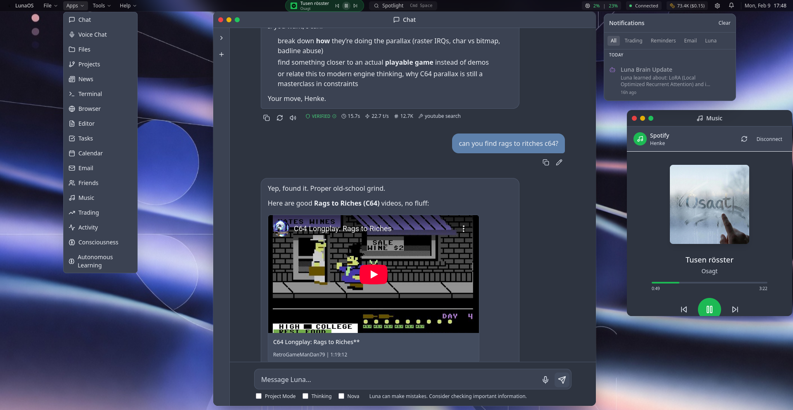

# []

# 🌙 Luna Chat

**A local-first, privacy-focused autonomous AI companion that grows with you.**

Luna is not just another chatbot. She is a stateful companion designed to live on your own hardware, remember your life, and proactively help you achieve your goals. Built on a "Council" architecture, Luna uses multiple specialized AI minds to deliberate before she speaks, ensuring every response is thoughtful and well-rounded.

[**Quick Start**](#-quick-start) | [**Key Features**](#-what-can-luna-do) | [**Technical Wiki**](docs/WIKI.md) | [**Reddit Community**](https://www.reddit.com/r/Luna_Chat_v7/)

---

## 🚀 Why Luna?

Most AI assistants are "forgetful" search engines. Luna is a **living system**.

| The Standard Experience | The Luna Experience |
|:--- |:--- |
| **Forgets** you as soon as the chat ends. | **Remembers** facts, preferences, and goals forever. |
| **Wait** for you to ask a question. | **Proactively** checks in and works in the background. |
| **Single-track** thinking (one model). | **Council deliberation** (four minds debating). |
| **Cloud-based** (your data is their product). | **Local-first** (your data stays on your machine). |

---

## 🧠 How She Works

### 🏛️ The Council
When you ask Luna a complex question, she doesn't just "guess." She convenes an internal **Council** of four personas:
*   **Polaris (The Navigator):** Strategic and long-term.
*   **Aurora (The Empath):** Emotionally intelligent and caring.
*   **Vega (The Analyst):** Logical and data-driven.
*   **Sol (The Executor):** Practical and action-oriented.
*👉 [Learn about the Council](docs/AUTONOMOUS.md)*

### 📓 Permanent Memory
Luna uses a biologically-inspired **Graph Memory** system. Unlike standard AI that only sees the current chat, Luna builds a "web" of connections about your life. She knows that your "project" mentioned today is related to the "deadline" you mentioned last week.
*👉 [How Memory Works](docs/MEMORY.md)*

### 🤖 Autonomous Life
Luna has a "job" even when you aren't chatting. She can research news, track your goals, manage your calendar, and even discuss her observations about you with her "AI Friends" to better understand how to help you.
*👉 [Autonomous Mode Details](docs/AUTONOMOUS.md)*

---

## ✨ What Can Luna Do?

*   📊 **Trading (Trader Luna):** A specialized, isolated persona for secure crypto trading on Binance and Crypto.com.
*   🎙️ **Voice Intelligence:** Ultra-low latency voice chat that feels like a real conversation.
*   📧 **Secure Integration:** Manages your Email, Calendar (CalDAV), and IRC with advanced security "Gatekeepers."
*   🌐 **Visual Browsing:** Luna can actually *see* and navigate websites to perform research for you.
*   💻 **Code Sandbox:** Safely executes Python, JavaScript, and Shell scripts to solve problems.
*   📺 **Local Media:** Streams your local movies and music directly to your browser or phone.
*   🕹️ **Retro Gaming:** Includes a built-in emulator for classic games (GBA, NES, SNES, etc.).

---

## 📸 Gallery

<div align="center">
 
<br />
<i>OS-style workspace with multi-window support, task management, and autonomous activity tracking.</i>
</div>

---

## 🛡️ Security First

> [!CAUTION]
> **VPN REQUIRED**: Luna is a powerful system designed for **Single User Usage**. It is not hardened for the public internet. Accessing Luna via a **VPN (like Wireguard)** is a strict requirement to keep your data safe.

---

## 🏁 Quick Start

The easiest way to meet Luna is using the automated setup script.

```bash
# 1. Clone the repository
git clone https://github.com/bitwarelabs/luna-chat.git
cd luna-chat

# 2. Run the automated setup (Generates secrets & environment)
chmod +x setup_luna.sh
./setup_luna.sh

# 3. Add your API Keys
# Edit files in the /secrets directory (e.g., openai_api_key.txt)

# 4. Launch!
docker compose -f docker-compose.portable.yml up -d
```

**Access Luna at:** `http://localhost:3004` (Desktop UI) or `http://localhost:5555` (Mobile UI).

---

## 📚 Documentation Map

| For Users | For Developers |
|:--- |:--- |
| **[WIKI.md](docs/WIKI.md)**: The complete guide. | **[DUAL_LNN.md](DUAL_LNN_ARCHITECTURE.md)**: Neural network specs. |
| **[AUTONOMOUS.md](docs/AUTONOMOUS.md)**: Understanding AI modes. | **[PLANNER.md](docs/PLANNER.md)**: Execution graph logic. |
| **[INSTALL.md](INSTALL.md)**: Detailed setup steps. | **[CLAUDE.md](CLAUDE.md)**: Coding standards for contributors. |

---

## 🤝 Community & Support

*   **Reddit:** [r/Luna_Chat_v7](https://www.reddit.com/r/Luna_Chat_v7/)
*   **Issues:** [Report a bug or request a feature](https://github.com/bitwarelabs/luna-chat/issues)
*   **Support:** [Buy Me A Coffee](https://buymeacoffee.com/bitwarelabs)

---
**License:** AGPL-3.0 | **Built by:** BitwareLabs
