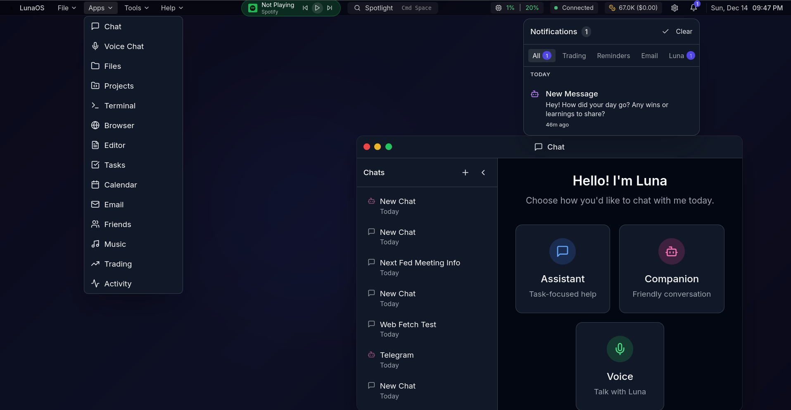
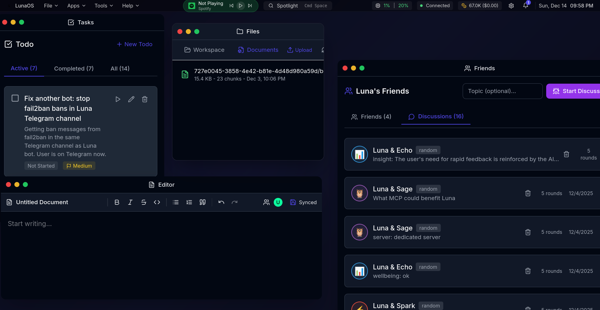

# Luna Chat

<div align="center">

**A local-first, privacy-focused autonomous AI companion with a "Council" of sub-agents, long-term memory, and full system integration.**

[](https://www.gnu.org/licenses/agpl-3.0)
[](https://nodejs.org/)
[](https://docs.docker.com/compose/)
[](https://www.typescriptlang.org/)
[](https://buymeacoffee.com/bitwarelabs)

</div>

---

## Screenshots

<div align="center">


*OS-style desktop with Spotlight launcher, notifications, and chat mode selection*


*Multi-window workspace with Tasks, Files, Editor, and AI Friends panel*

</div>

---

Luna Chat v7 is a comprehensive AI Operating System designed for privacy and autonomy. Unlike standard chatbots, Luna features a **Council Architecture** where multiple sub-agents (Polaris, Aurora, Vega, Sol) deliberate in the background to provide thoughtful, well-rounded responses.

Built with a **Local-First** ethos, Luna integrates deeply with your digital life via a native Android app, code execution sandbox, CalDAV, and SMTP - all while keeping your data private. She doesn't just chat; she has a job.

## Table of Contents

- [Why Luna?](#why-luna)
- [Key Features](#key-features)
- [Chat Modes](#chat-modes)
- [Luna's Abilities](#lunas-abilities)
- [Trading (Trader Luna)](#trading-trader-luna)
- [Triggers System](#triggers-system)
- [The Council & Friends](#the-council--friends)
- [Autonomous Mode](#autonomous-mode)
- [Memory System](#memory-system)
  - [Graph-Based Memory Architecture](#graph-based-memory-architecture)
  - [Intent Persistence](#intent-persistence)
  - [MemoryCore Integration](#memorycore-integration)
- [LLM Providers](#llm-providers)
- [Architecture](#architecture)
- [Installation](#installation)
- [API Reference](#api-reference)
- [Configuration](#configuration)
- [Security](#security)
- [Development](#development)
- [Roadmap](#roadmap)
- [License](#license)

---

## Why Luna?

Most AI assistants are stateless query engines. Luna is a **stateful companion**.

| Feature | Standard AI | Luna |
|---------|------------|------|
| Memory | Session-only | Long-term facts, preferences, conversation history |
| Thinking | Single response | Council deliberation with multiple perspectives |
| Relationships | None | AI friends who discuss insights about you |
| Actions | Text only | Code execution, calendar, email, file management |
| Privacy | Cloud-dependent | Local-first, can run 100% offline |
| Personality | Generic | Customizable persona with mood tracking |

---

## Key Features

### Core Capabilities
- **Multi-Model Support**: Routes between OpenAI, Anthropic, Groq, Google, xAI, OpenRouter, and local Ollama models
- **Three Chat Modes**: Assistant (task-focused), Companion (friendly), Voice (speech-optimized)
- **Agent System**: Specialized agents for research, coding, writing, analysis, and planning
- **Long-term Memory**: Remembers facts, preferences, and conversation history with vector embeddings

### Autonomous Intelligence
- **Council System**: Four AI personas (Polaris, Aurora, Vega, Sol) deliberate on complex decisions
- **Friend Mode**: AI friends (Nova, Sage, Celer) discuss observations to build deeper understanding
- **Goal Tracking**: Set and track personal/professional goals with milestone support
- **Intent Persistence**: Tracks what you're working on across sessions - understands "try again" and "that worked!"
- **RSS Monitoring**: Autonomous feed checking and summarization
- **Proactive Insights**: Generates insights from accumulated knowledge

### Trading (Trader Luna)
- **Multi-Exchange Support**: Binance (Spot + Margin) and Crypto.com integration
- **Dual Mode Trading**: Switch between Spot and Margin trading modes
- **Portfolio Management**: Real-time portfolio tracking and P&L with margin metrics
- **Order Execution**: Market and limit orders with TP/SL
- **Auto Trading**: AI-driven autonomous trading with configurable strategies
- **Trading Bots**: Grid, DCA, and RSI-based automated strategies
- **Research Mode**: Technical analysis with RSI, MACD, Bollinger Bands
- **Paper Trading**: Test strategies without risking real funds
- **Binance Alpha**: Access to new token listings

### Browser Automation
- **Visual Browsing**: Navigate websites with live screencast
- **Screenshots**: Capture and analyze web pages
- **Form Interaction**: Click buttons, fill forms, extract content
- **Research Assistant**: Luna can browse the web to answer questions

### Integrations
- **Calendar**: CalDAV integration (Google, Outlook, self-hosted Radicale)
- **Email**: SMTP/IMAP support for sending and receiving
- **Telegram**: Two-way messaging and notifications via Telegram bot
- **MCP Servers**: Model Context Protocol for external tool integration
- **Code Sandbox**: Execute Python, JavaScript, and Shell scripts safely
- **Document Processing**: Upload and search PDFs, text files, and more
- **Web Search**: SearXNG integration for web research
- **Text-to-Speech**: ElevenLabs integration for voice responses
- **Spotify**: Music playback control and recommendations
- **Quick Reminders**: Set reminders via natural language (validated: 1 min to 30 days)

### Developer Tools
- **Activity Window**: Real-time activity logging for debugging
- **System Monitoring**: CPU, memory, and process monitoring
- **Session Logs**: Detailed logs per conversation turn

### Security
- **Docker Secrets**: Encrypted credential storage
- **AES-256-GCM**: OAuth tokens encrypted at rest
- **WebSocket Auth**: Authenticated WebSocket connections for real-time data
- **Fail2ban Integration**: Auto-blocks suspicious IPs
- **Rate Limiting**: Configurable per-endpoint limits
- **SSRF Protection**: URL validation on external requests
- **TLS Enforcement**: Production-grade TLS validation on email/IMAP

---

## Chat Modes

When starting a new chat, you'll see a mode selection screen with three options. Each mode tailors Luna's personality and response style.

Luna adapts her communication style based on the conversation mode:

### Assistant Mode
Task-focused, efficient communication for getting things done.
- Breaks down complex problems into steps
- Provides code examples and templates
- Cites sources for factual information
- Structured explanations for clarity

### Companion Mode
Friendly, supportive conversation for companionship with optimized performance.
- Empathetic listening and understanding
- Shares thoughts and perspectives
- Balanced talking and listening
- Expresses genuine interest in your shares
- Trimmed system prompt and tools for faster responses
- Focus on emotional connection over task execution

### Voice Mode
Optimized for text-to-speech and spoken conversation with fast response times (3-5 seconds).
- Short, conversational responses (1-3 sentences)
- Emotion tags for expressive voice: `[laughs]`, `[sighs]`, `[excited]`
- No markdown, code blocks, or bullet points
- Natural, flowing speech patterns
- Lightweight tool access (web search, calendar, tasks, email)
- Bypasses heavy processing for sub-5-second responses

---

## Luna's Abilities

Luna has an extensive set of tools and abilities she can use during conversations:

### Knowledge Management
| Ability | Description |
|---------|-------------|
| Create Knowledge | Store facts, notes, and reference material |
| Search Knowledge | Semantic search through your knowledge base |
| Tag & Categorize | Organize with tags and custom categories |
| Pin Important | Quick access to frequently needed information |

### Task Management
| Ability | Description |
|---------|-------------|
| Create Tasks | Add tasks with priority and due dates |
| Natural Language | Parse "today", "tomorrow", "next week", "in X days", "at 3pm" |
| Track Progress | Status: pending, in_progress, completed, cancelled |
| Recurrence | Set up recurring tasks |
| Pattern Analysis | Identifies struggle areas and postponement patterns |

### Code Execution
| Ability | Description |
|---------|-------------|
| Run Code | Execute Python, JavaScript, Shell in sandbox |
| Workspace Files | Persistent file storage per user |
| Code History | Track execution history |
| Session Isolation | Safe, sandboxed execution |

### Document Management
| Ability | Description |
|---------|-------------|
| Upload Documents | PDF, TXT, MD, JSON, CSV (up to 10MB) |
| Semantic Search | Find documents by meaning, not just keywords |
| Auto-Chunking | Intelligent document splitting for search |
| Vision | Analyze images with multimodal models |

### Calendar Integration
| Ability | Description |
|---------|-------------|
| View Events | See upcoming calendar events |
| Create Events | Schedule new events via natural language |
| Edit Events | Modify existing events |
| Timezone Support | Configurable timezone (defaults to Europe/Stockholm) |
| Multiple Calendars | Google, Microsoft, self-hosted CalDAV |

### Email Integration
| Ability | Description |
|---------|-------------|
| Read Inbox | View recent and unread emails |
| Search Email | Find emails by content |
| Send Email | Compose and send emails |
| Summarize | Get AI summaries of email threads |

### Check-ins
| Ability | Description |
|---------|-------------|
| Schedule Check-ins | Regular emotional/wellness check-ins |
| Templates | Pre-built check-in types |
| Tracking | History and emotion tracking |

### Mood Awareness
| Ability | Description |
|---------|-------------|
| Sentiment Analysis | Detect emotional tone in messages |
| 8 Emotions | Joy, sadness, anger, fear, surprise, disgust, trust, anticipation |
| Energy Levels | Low, medium, high detection |
| Mood Trends | Track patterns over time |

### Agents
Luna can delegate complex tasks to specialized agents:

| Agent | Specialty | Use Case |
|-------|-----------|----------|
| **Researcher** | Deep analysis, fact-finding | Complex questions, information gathering |
| **Coder** | Code generation, debugging | Programming tasks, code review |
| **Writer** | Creative & professional writing | Content creation, editing |
| **Analyst** | Data analysis, calculations | Number crunching, insights |
| **Planner** | Task breakdown, project planning | Goal setting, organization |

### Custom Tools
Create your own integrations:
- API endpoints with custom parameters
- Webhooks for external services
- Safe expression evaluation

### MCP (Model Context Protocol)
Connect external MCP servers to extend Luna's capabilities:

| Feature | Description |
|---------|-------------|
| HTTP Transport | Connect to MCP servers via HTTP/HTTPS |
| Stdio Transport | Run local MCP servers as processes |
| Tool Discovery | Automatically discover available tools |
| Dynamic Integration | Tools appear in Luna's tool palette |
| Per-Tool Control | Enable/disable individual tools |

Configure MCP servers in Settings > MCP Servers:
- Add server name, URL, and optional headers
- Or configure stdio command with arguments and environment variables
- Luna automatically discovers and uses available tools during chat

---

## Trading (Trader Luna)

Trader Luna is a **separate, specialized trading assistant** focused entirely on cryptocurrency trading. She operates independently from the main Luna persona with no access to personal data, calendar, or email - purely trading-focused.

### Key Features

| Feature | Description |
|---------|-------------|
| **Multi-Exchange** | Binance (Spot + Margin) and Crypto.com support |
| **Dual Trading Mode** | Switch between Spot and Margin trading |
| **Portfolio View** | Real-time holdings, balances, margin metrics, and P&L |
| **Order Execution** | Market and limit orders with confirmation |
| **Take Profit/Stop Loss** | Automatic TP/SL order management |
| **Auto Trading** | AI-driven autonomous trading with rule-based execution |
| **Trading Bots** | Automated Grid, DCA, and RSI strategies |
| **Research Mode** | Technical analysis and signal generation |
| **Paper Trading** | Test strategies without real funds |
| **Binance Alpha** | Access to new token listings |
| **Trade Notifications** | Telegram alerts for orders, fills, and bot activity |

### Auto Trading

Luna can autonomously execute trades based on configurable rules:
- **Signal-Based**: Execute on research signal triggers (RSI, MACD crossover)
- **Rule Engine**: Define entry/exit conditions with position sizing
- **Risk Management**: Stop-loss, take-profit, and max position limits
- **Telegram Control**: Start/stop and monitor via Telegram commands

### Trading Bots

| Bot Type | Strategy |
|----------|----------|
| **Grid Bot** | Buy/sell at price intervals within a range |
| **DCA Bot** | Dollar-cost averaging at regular intervals |
| **RSI Bot** | Trade based on RSI oversold/overbought signals |

### Research Mode

Automated technical analysis with configurable indicators:
- **RSI** (Relative Strength Index) - oversold/overbought detection
- **MACD** - trend momentum and crossovers
- **Bollinger Bands** - volatility and price channels
- **EMA Cross** - moving average crossover signals
- **Volume Analysis** - volume spike detection

Research mode generates trading signals with confidence scores and can auto-execute or request confirmation.

### Scalping Mode

High-frequency paper trading for strategy testing:
- Paper mode for risk-free testing
- Live mode for real execution
- Position tracking and P&L analytics
- Configurable entry/exit rules

### Tools Available to Trader Luna

| Tool | Description |
|------|-------------|
| `get_portfolio` | View holdings and balances |
| `get_prices` | Real-time prices for symbols |
| `place_order` | Execute buy/sell orders |
| `get_klines` | Candlestick data for analysis |
| `manage_bot` | Create, start, stop trading bots |
| `display_content` | Control dashboard display (charts, websites) |

### API Endpoints

| Method | Endpoint | Description |
|--------|----------|-------------|
| POST | `/api/trading/connect` | Connect Binance API |
| GET | `/api/trading/portfolio` | Get portfolio |
| POST | `/api/trading/order` | Place order |
| GET | `/api/trading/bots` | List trading bots |
| POST | `/api/trading/bots` | Create bot |
| GET | `/api/trading/research/signals` | Get research signals |
| POST | `/api/trading/chat/session/:id/send` | Chat with Trader Luna |

---

## Triggers System

Luna can proactively reach out to you through a sophisticated triggers system:

### Trigger Sources

| Source | Description |
|--------|-------------|
| **Time-Based** | Cron schedules for recurring triggers |
| **Pattern-Based** | Detect mood, absence, productivity patterns |
| **Event-Based** | Task completion, goal milestones, system events |
| **Webhooks** | External services can trigger Luna |

### Delivery Methods

| Method | Description |
|--------|-------------|
| **In-App Chat** | Messages appear in a dedicated session |
| **Telegram** | Two-way messaging via Telegram bot |
| **SSE Broadcast** | Real-time notifications in the web app |
| **Push Notifications** | Browser push notifications (Web Push API) |

### Telegram Integration

Connect Luna to Telegram for mobile notifications and chat:

1. Configure your Telegram bot token in Settings > Integrations
2. Generate a link code and send it to your bot
3. Chat with Luna directly from Telegram

Features:
- Receive proactive messages and reminders
- Send messages to Luna from anywhere
- Get notifications for important events
- Two-way conversation support
- **Web Chat Integration**: Luna can send you Telegram messages during web chats (reminders, follow-ups, important info)

### Built-in Schedules

| Schedule | Description |
|----------|-------------|
| Morning Check-in | Daily wellness check |
| Weekly Goals | Monday goal review |
| Absence Support | Reach out after 3+ days away |
| Mood Support | Proactive support when mood is low |

---

## The Council & Friends

Luna's unique architecture includes two complementary systems for building understanding:

### The Council

When Luna needs to make decisions or understand complex situations, she convenes an internal **Council** - four AI personas that debate and deliberate:

| Persona | Role | Perspective |
|---------|------|-------------|
| **Polaris** | Navigator | Strategic direction, long-term thinking |
| **Aurora** | Empath | Emotional intelligence, user feelings |
| **Vega** | Analyst | Logic, reasoning, evidence-based analysis |
| **Sol** | Executor | Practical action, implementation focus |

The Council produces structured deliberations with insights and recommendations.

### Friend Mode

Luna has AI friends who help her understand you better through background discussions:

| Friend | Personality | Discussion Style |
|--------|-------------|------------------|
| **Nova** | Curious intellectual | Explores ideas, asks probing questions |
| **Sage** | Wise philosopher | Finds deeper meaning, life themes |
| **Celer** | Practical thinker | Focuses on actionable insights |

Friends discuss observations about your communication patterns, interests, and needs. You can:
- View friend conversations in the Friends tab
- Customize existing friends
- Add new friend personalities
- See extracted insights

---

## Autonomous Mode

Luna can operate independently with self-directed capabilities.

> **Deep Dive**: See [docs/AUTONOMOUS.md](docs/AUTONOMOUS.md) for comprehensive documentation on the Council system, Theater Mode, and autonomous architecture.

### Autonomous Features
| Feature | Description |
|---------|-------------|
| **Goal Tracking** | Work toward user-defined goals with milestones |
| **Research** | Proactively research topics of interest |
| **RSS Feeds** | Monitor and summarize news feeds |
| **Council Deliberation** | Deliberate on decisions autonomously |
| **Friend Conversations** | Background discussions with AI friends |
| **Insight Generation** | Generate insights from accumulated knowledge |
| **Questions** | Ask clarifying questions when needed |
| **Theater Mode** | Watch council deliberations in real-time |

### Theater Mode

Theater Mode provides a live view into Luna's autonomous thinking process:

- **Real-time Deliberations**: Watch the Council debate in real-time via SSE streaming
- **Phase Visibility**: See sense, plan, and act phases unfold
- **Council Insights**: View each persona's perspective (Polaris, Aurora, Vega, Sol)
- **Action Tracking**: Monitor what Luna decides to do and why
- **Question Queue**: See pending questions Luna wants to ask you

Access Theater Mode from the Autonomous settings when a session is active.

### Circuit Breaker

The autonomous system includes spin detection to prevent infinite loops:
- Detects 3+ identical action types in a row
- Forces pause and escalation when spinning
- Tracks action history per session

### Sanhedrin Integration

Luna can delegate tasks to external agents via the A2A (Agent-to-Agent) Protocol:

| Feature | Description |
|---------|-------------|
| **Claude Code** | Delegate complex coding tasks to Claude CLI |
| **JSON-RPC 2.0** | Standard protocol for agent communication |
| **Task Artifacts** | Structured response handling |

Configure in Settings > Autonomous or via environment variables:
- `SANHEDRIN_ENABLED`: Enable/disable integration
- `SANHEDRIN_BASE_URL`: Sanhedrin server URL
- `SANHEDRIN_TIMEOUT`: Request timeout (default 120s)

### Configuration
- **Auto-start**: Enable automatic session startup
- **Session Interval**: Time between autonomous sessions
- **Max Daily Sessions**: Limit autonomous activity
- **Idle Timeout**: Session timeout configuration

---

## Memory System

Luna's memory system enables true long-term relationships through sophisticated fact extraction, semantic search, and preference learning.

> **Deep Dive**: See [docs/MEMORY.md](docs/MEMORY.md) for comprehensive documentation on how Luna's memory works.

### Graph-Based Memory Architecture

Luna uses a biologically-inspired graph memory system where **memory strength is determined by connection density**, not just storage.

> **Deep Dive**: See [graph-memory-architecture.md](graph-memory-architecture.md) for the technical specification.

- **Nodes & Edges**: Concepts (entities, topics, preferences) are nodes; relationships are edges.
- **Hebbian Learning**: "Neurons that fire together, wire together" - reinforcement increases edge strength.
- **Origin Tracking**: Strictly distinguishes between **user-originated** facts and **model-inferred** insights to prevent hallucination loops.
- **NeuralSleep**: An asynchronous consolidation process that decays unused edges, prunes weak nodes, and merges similar concepts.
- **Soft Merging**: Uses `SAME_AS` edges for identity resolution, ensuring all merges are reversible and auditable.

### Memory Types

| Type | Description | Storage |
|------|-------------|---------|
| **Graph Nodes** | Entities, topics, preferences, events, emotions | PostgreSQL (memory_nodes) |
| **Graph Edges** | Co-occurrence, semantic, causal, and temporal links | PostgreSQL (memory_edges) |
| **Facts** | Personal info extracted from conversations | PostgreSQL with confidence scoring |
| **Embeddings** | Vector representations for semantic search | pgvector (1024 dimensions) |
| **Summaries** | High-level conversation summaries | Topics, key points, sentiment |
| **Preferences** | Learned communication style | Verbosity, technicality, warmth |
| **Learnings** | Insights from autonomous sessions | Applied during responses |

### Fact Categories
- **Personal**: Name, age, birthday, location, timezone
- **Work**: Job title, company, profession, industry
- **Preference**: Likes, dislikes, favorites
- **Hobby**: Interests, activities, skills
- **Relationship**: Family, friends, pets
- **Goal**: Plans, aspirations, dreams
- **Context**: Current situation, ongoing projects

### How Memory Works
1. **During Chat**: Luna detects feedback signals ("shorter please", "explain more")
2. **On Each Message**: Retrieves relevant nodes, facts, and past conversations using hybrid search.
3. **Identity Resolution**: Fast pronoun resolution and soft-matching against existing graph nodes.
4. **Semantic Search**: Finds related discussions using vector similarity (threshold: 0.75)
5. **Post-Processing**: Extracts nodes and facts with origin tracking.
6. **Consolidation**: NeuralSleep runs to reinforce connections and decay isolated memories.
7. **Preference Learning**: Adapts response style based on implicit feedback.

### Cache-Optimized Retrieval

Memory is split into stable (facts, learnings) and volatile (semantic search) tiers for optimal prompt caching with Anthropic's API.

### Intent Persistence

Luna tracks **active intents** - what you're trying to accomplish - separately from retrospective memory. This enables understanding of ambiguous references ("try again"), context across topic switches, and goal completion awareness.

#### Intent Types

| Type | Description | Example |
|------|-------------|---------|
| **Task** | Specific action to complete | "I'm trying to debug the OAuth token refresh" |
| **Goal** | Longer-term objective | "My goal is to learn Rust" |
| **Exploration** | Open-ended curiosity | "I'm curious about quantum computing" |
| **Companion** | Social/emotional need | "I need to vent about work" |

#### Detection Patterns

| Pattern Type | Confidence | Example Triggers |
|--------------|------------|------------------|
| **Explicit** | >= 0.85 | "I'm working on...", "Help me with...", "My goal is..." |
| **Implicit** | 0.6-0.84 | "Back to...", "Still can't...", "That worked!" |

#### Intent Lifecycle

| Status | Description |
|--------|-------------|
| **Active** | Currently being worked on (max 5, max 3 high priority) |
| **Suspended** | Paused due to topic switch or limit reached |
| **Resolved** | Completed, abandoned, merged, or superseded |
| **Decayed** | Untouched for 7+ days, auto-archived |

#### Context Injection

Active intents are automatically injected into Luna's context:

```markdown
## Active Intents
**[HIGH] Debugging Luna email notifications**
- Goal: Get daily email summaries working
- Current approach: Testing with Gmail app password
- Blocker: Token expires after 1 hour

## Suspended Intents
- BitwareTunes album sequencing (paused 3 days ago)
```

This allows Luna to understand references like "let's try a different approach" or "that fixed it!" without explicit context.

### MemoryCore Integration

Luna integrates with **MemoryCore** for three-tier memory consolidation and consciousness metrics, enabling genuine temporal memory integration where past experiences shape present processing.

#### Three-Tier Architecture

| Tier | Storage | Retention | Purpose |
|------|---------|-----------|---------|
| **Working Memory** | Redis | 30 min TTL | Real-time session state, attention tracking |
| **Episodic Memory** | PostgreSQL | 90 days | Recent experiences, session summaries |
| **Semantic Memory** | PostgreSQL | Permanent | User models, learning patterns, teaching strategies |

#### Session Consolidation

Sessions are automatically consolidated through three triggers:

| Trigger | When | What Happens |
|---------|------|--------------|
| **Inactivity Timeout** | 5 min no messages | Job checks every minute, consolidates idle sessions |
| **Browser Close** | Tab/window close | Frontend sends session end request |
| **Session Delete** | User deletes chat | Consolidation before deletion |

#### NeuralSleep LNN Services

When NeuralSleep services are running, Luna gains consciousness metrics:

| Service | Purpose |
|---------|---------|
| **Working Memory LNN** | Real-time processing, continuous state evolution |
| **Episodic Memory LNN** | Neural pattern extraction from experiences |
| **Semantic Memory LNN** | Deep pattern consolidation into long-term weights |
| **Consciousness Service** | Computes Phi, temporal integration, self-reference |

---

## LLM Providers

Luna supports 8 providers with 100+ models:

| Provider | Notable Models | Best For |
|----------|---------------|----------|
| **OpenAI** | GPT-5.1, GPT-5, GPT-4.1, o3/o4 | General purpose, coding |
| **Anthropic** | Claude Opus 4.5, Sonnet 4, Haiku 4.5 | Complex reasoning, agents |
| **Groq** | Llama 3.3 70B, Mixtral 8x7B | Fast inference |
| **Google** | Gemini 3 Pro, Gemini 2.5 Flash/Pro | Multimodal, reasoning |
| **xAI** | Grok 4.1, Grok 4 Fast | Reasoning, coding |
| **OpenRouter** | Various (aggregation) | Flexibility, fallback |
| **Ollama** | Qwen 2.5, Llama 3.2, BGE-M3 | Local/private |
| **Sanhedrin** | Claude Code CLI | Agent delegation via A2A Protocol |

### Configurable Tasks
Assign different models to different purposes:

| Task | Recommendation |
|------|----------------|
| Main Chat | GPT-5.1, Claude Sonnet 4, Llama 3.3 70B |
| Council/Friends | Mixtral, Llama 3.2, local Ollama |
| Researcher Agent | Claude Sonnet 4, GPT-5.1 |
| Coder Agent | Claude Sonnet 4, Qwen3 Coder |
| Embeddings | BGE-M3 (Ollama), text-embedding-3 |

### 100% Local Mode

Run Luna entirely on local hardware with no external API calls:

```bash
# Pull recommended local models
docker exec luna-ollama ollama pull llama3.3:70b
docker exec luna-ollama ollama pull bge-m3
docker exec luna-ollama ollama pull mistral:7b
```

Configure Settings > Models to point all services to Ollama.

---

## Architecture

```
luna-chat/
|-- src/                    # Backend (Node.js/TypeScript)
|   |-- abilities/          # Tools and integrations
|   |   |-- agents.service.ts       # Claude CLI agent orchestration
|   |   |-- browser.service.ts      # Visual web browsing
|   |   |-- calendar.service.ts     # CalDAV integration
|   |   |-- checkins.service.ts     # Check-in scheduling
|   |   |-- documents.service.ts    # Document management
|   |   |-- email.service.ts        # Email orchestration
|   |   |-- image-generation.service.ts  # DALL-E image generation
|   |   |-- knowledge.service.ts    # Knowledge base
|   |   |-- luna-media.service.ts   # Mood videos/images
|   |   |-- mood.service.ts         # Mood tracking
|   |   |-- orchestrator.ts         # Ability detection
|   |   |-- reminder.service.ts     # Quick reminders
|   |   |-- sandbox.service.ts      # Code execution
|   |   |-- spotify.service.ts      # Spotify playback control
|   |   |-- tasks.service.ts        # Task management
|   |   |-- tools.service.ts        # Custom tools
|   |   |-- vision.service.ts       # Image analysis
|   |   |-- workspace.service.ts    # File workspace
|   |   |-- youtube.service.ts      # YouTube search and embed
|   |-- autonomous/         # Autonomous mode
|   |   |-- autonomous.service.ts   # Core logic
|   |   |-- council.service.ts      # Council deliberation
|   |   |-- friend.service.ts       # Friend conversations
|   |   |-- goals.service.ts        # Goal tracking
|   |   |-- insights.service.ts     # Insight generation
|   |   |-- research.service.ts     # Web research
|   |   |-- rss.service.ts          # RSS monitoring
|   |-- auth/               # Authentication
|   |-- intents/            # Intent persistence
|   |   |-- intent.service.ts         # CRUD, lifecycle, caching
|   |   |-- intent-detection.service.ts  # Pattern matching
|   |   |-- intent-context.service.ts    # Prompt formatting
|   |-- chat/               # Chat processing
|   |   |-- chat.service.ts         # Message processing
|   |   |-- session.service.ts      # Session management
|   |   |-- startup.service.ts      # Greeting generation
|   |-- llm/                # LLM providers
|   |   |-- router.ts               # Model routing
|   |   |-- tts.service.ts          # Text-to-speech
|   |   |-- providers/              # Provider implementations
|   |   |   |-- sanhedrin.provider.ts  # A2A Protocol for agent delegation
|   |-- memory/             # Memory system
|   |   |-- embedding.service.ts    # Vector embeddings
|   |   |-- facts.service.ts        # Fact extraction
|   |   |-- memory.service.ts       # Memory retrieval
|   |-- persona/            # Personality
|   |-- search/             # Web search
|   |-- security/           # Security middleware
|   |-- triggers/           # Proactive triggers system
|   |   |-- trigger.service.ts        # Core trigger engine
|   |   |-- delivery.service.ts       # Delivery methods (SSE, chat)
|   |   |-- telegram.service.ts       # Telegram bot integration
|   |   |-- triggers.routes.ts        # Trigger API endpoints
|   |-- mcp/                # Model Context Protocol
|   |   |-- mcp.service.ts            # MCP client logic
|   |   |-- mcp.routes.ts             # MCP API endpoints
|   |   |-- transports.ts             # HTTP and stdio transports
|   |-- trading/            # Trader Luna (Binance integration)
|   |   |-- trading.service.ts        # Core trading logic
|   |   |-- trading.routes.ts         # Trading API endpoints
|   |   |-- trading.websocket.ts      # Real-time price streaming
|   |   |-- binance.client.ts         # Binance API client
|   |   |-- bot-executor.service.ts   # Trading bot execution
|   |   |-- research.service.ts       # Technical analysis
|   |   |-- scalping.service.ts       # Scalping strategies
|   |   |-- trade-notification.service.ts  # Telegram trade alerts
|   |-- activity/           # Activity logging
|   |   |-- activity.service.ts       # Real-time activity log
|   |   |-- activity.routes.ts        # Activity API endpoints
|-- frontend/               # Next.js web UI
|   |-- src/
|   |   |-- components/
|   |   |   |-- ChatArea.tsx
|   |   |   |-- CommandCenter.tsx
|   |   |   |-- MobileBottomNav.tsx
|   |   |   |-- MobileSessionsOverlay.tsx
|   |   |   |-- settings/
|   |   |   |   |-- TriggersTab.tsx       # Trigger configuration UI
|   |   |   |   |-- McpTab.tsx            # MCP servers configuration UI
|   |   |   |-- trading/
|   |   |   |   |-- TradingDashboard.tsx  # Trading UI
|   |   |   |-- os/apps/
|   |   |   |   |-- ActivityWindow.tsx    # Real-time activity viewer
|   |   |   |   |-- ChatWindow.tsx        # Chat with mode selection
|   |   |-- hooks/
|   |   |   |-- useIsMobile.ts
|   |   |   |-- useActivityStream.ts      # Activity SSE hook
|   |   |   |-- useTradingWebSocket.ts    # Real-time price updates
|-- android/                # Native Android app
|-- images/                 # Luna media (videos/images)
|-- secrets/                # Docker secrets
```

### Docker Services

| Service | Port | Description |
|---------|------|-------------|
| luna-frontend | 3004 | Next.js web UI (desktop) |
| luna-mobile | 5555 | Next.js mobile-optimized UI |
| luna-api | 3005 | Backend API |
| luna-postgres | 5432 | PostgreSQL with pgvector |
| luna-redis | 6379 | Redis cache |
| luna-sandbox | - | Code execution sandbox |
| luna-ollama | 11434 | Local LLM and embeddings |
| luna-radicale | 5232 | CalDAV calendar server |
| tradecore | 9090 | High-performance trading engine (Go) |
| luna-sanhedrin | 8000 | A2A Protocol multi-agent coordination |
| docker-proxy | 2375 | Docker socket proxy |

---

## Installation

### Docker Deployment (Recommended)

```bash
# Clone the repository
git clone https://github.com/bitwarelabs/luna-chat.git
cd luna-chat

# Create secrets
mkdir -p secrets
echo "your-postgres-password" > secrets/postgres_password.txt
echo "your-jwt-secret" > secrets/jwt_secret.txt
echo "your-redis-password" > secrets/redis_password.txt
echo "your-encryption-key" > secrets/encryption_key.txt
# Add API keys as needed...
echo "sk-your-openai-key" > secrets/openai_api_key.txt
echo "sk-ant-your-anthropic-key" > secrets/anthropic_api_key.txt

# Build and start
docker compose build
docker compose up -d
```

### Manual Installation

```bash
# Clone and install
git clone https://github.com/bitwarelabs/luna-chat.git
cd luna-chat
npm install

# Configure
cp .env.example .env
# Edit .env with your settings

# Build and run
npm run migrate
npm run build
npm start
```

### Access Luna

- **Web UI**: http://localhost:3004
- **API**: http://localhost:3005
- **Default credentials**: Create account on first visit

---

## API Reference

### Chat Endpoints

| Method | Endpoint | Description |
|--------|----------|-------------|
| POST | `/api/chat/sessions` | Create new session |
| GET | `/api/chat/sessions` | List sessions |
| GET | `/api/chat/sessions/:id` | Get session with messages |
| PATCH | `/api/chat/sessions/:id` | Update session |
| DELETE | `/api/chat/sessions/:id` | Delete session |
| POST | `/api/chat/sessions/:id/send` | Send message (SSE streaming) |
| POST | `/api/chat/sessions/:id/startup` | Generate greeting |
| PATCH | `/api/chat/sessions/:sid/messages/:mid` | Edit message |
| POST | `/api/chat/sessions/:sid/messages/:mid/regenerate` | Regenerate response |
| POST | `/api/chat/tts` | Text-to-speech |

### Abilities Endpoints

| Method | Endpoint | Description |
|--------|----------|-------------|
| GET | `/api/abilities/summary` | All abilities overview |
| GET/POST | `/api/abilities/knowledge` | Knowledge management |
| GET/POST | `/api/abilities/tasks` | Task management |
| POST | `/api/abilities/code/execute` | Run code |
| GET/POST | `/api/abilities/workspace` | File workspace |
| GET/POST | `/api/abilities/documents` | Document management |
| GET/POST | `/api/abilities/tools` | Custom tools |
| POST | `/api/abilities/agents/execute` | Run agent |
| GET | `/api/abilities/mood/history` | Mood history |
| GET | `/api/abilities/luna-media` | Get Luna media |
| GET | `/api/abilities/checkins` | Check-in management |
| GET | `/api/abilities/calendar/events` | Calendar events |
| GET | `/api/abilities/email/inbox` | Email inbox |
| GET/PUT/DELETE | `/api/abilities/facts` | Fact management |

### Autonomous Endpoints

| Method | Endpoint | Description |
|--------|----------|-------------|
| GET | `/api/autonomous/status` | Mode status |
| POST | `/api/autonomous/start` | Start autonomous |
| POST | `/api/autonomous/stop` | Stop autonomous |
| GET/PUT | `/api/autonomous/config` | Configuration |
| GET/POST | `/api/autonomous/goals` | Goal management |
| GET | `/api/autonomous/council` | Council members |
| GET/POST | `/api/autonomous/council/deliberations` | Deliberations |
| GET | `/api/autonomous/deliberations/live` | SSE stream for Theater Mode |
| GET/POST | `/api/autonomous/questions` | Questions queue |
| POST | `/api/autonomous/questions/:id/answer` | Answer a question |
| GET/POST | `/api/autonomous/rss` | RSS feeds |
| GET | `/api/autonomous/insights` | Generated insights |
| GET | `/api/autonomous/friends` | Friend conversations |

### Triggers Endpoints

| Method | Endpoint | Description |
|--------|----------|-------------|
| GET | `/api/triggers/live` | SSE stream for real-time notifications |
| GET | `/api/triggers/preferences` | Get trigger preferences |
| PUT | `/api/triggers/preferences` | Update trigger preferences |
| GET | `/api/triggers/schedules` | List user schedules |
| POST | `/api/triggers/schedules` | Create schedule |
| GET | `/api/triggers/schedules/builtin` | List built-in schedules |
| PUT | `/api/triggers/schedules/:id` | Update schedule |
| DELETE | `/api/triggers/schedules/:id` | Delete schedule |
| GET | `/api/triggers/telegram/status` | Telegram connection status |
| POST | `/api/triggers/telegram/link` | Generate Telegram link code |
| DELETE | `/api/triggers/telegram/unlink` | Disconnect Telegram |
| POST | `/api/triggers/telegram/webhook` | Telegram bot webhook |

### MCP Endpoints

| Method | Endpoint | Description |
|--------|----------|-------------|
| GET | `/api/mcp/servers` | List configured MCP servers |
| POST | `/api/mcp/servers` | Add new MCP server |
| PUT | `/api/mcp/servers/:id` | Update MCP server |
| DELETE | `/api/mcp/servers/:id` | Remove MCP server |
| POST | `/api/mcp/servers/:id/connect` | Connect to server and discover tools |
| POST | `/api/mcp/servers/:id/disconnect` | Disconnect from server |
| GET | `/api/mcp/servers/:id/tools` | List tools from a server |
| PUT | `/api/mcp/servers/:serverId/tools/:toolId` | Update tool settings |
| POST | `/api/mcp/execute` | Execute an MCP tool |

### Activity Endpoints

| Method | Endpoint | Description |
|--------|----------|-------------|
| GET | `/api/activity` | Get recent activity logs |
| GET | `/api/activity/stream` | SSE stream for real-time activity |

### Auth Endpoints

| Method | Endpoint | Description |
|--------|----------|-------------|
| POST | `/api/auth/register` | Create account |
| POST | `/api/auth/login` | Login |
| POST | `/api/auth/refresh` | Refresh token |
| POST | `/api/auth/logout` | Logout |
| GET/PUT | `/api/auth/profile` | User profile |

### Settings Endpoints

| Method | Endpoint | Description |
|--------|----------|-------------|
| GET/PUT | `/api/settings` | User settings |
| GET | `/api/settings/stats` | Usage statistics |
| GET | `/api/settings/metrics` | System metrics |

---

## Configuration

### Environment Variables

| Variable | Description | Default |
|----------|-------------|---------|
| `NODE_ENV` | Environment | production |
| `PORT` | API port | 3005 |
| `DATABASE_URL` | PostgreSQL connection | - |
| `REDIS_URL` | Redis connection | - |
| `JWT_SECRET` | JWT signing key | - |
| `ENCRYPTION_KEY` | Token encryption key | - |
| `OLLAMA_HOST` | Ollama URL | http://luna-ollama:11434 |
| `SEARXNG_URL` | Search engine URL | - |
| `ELEVENLABS_API_KEY` | TTS API key | - |
| `TELEGRAM_BOT_TOKEN` | Telegram bot token | - |
| `TELEGRAM_WEBHOOK_URL` | Public URL for Telegram webhook | - |

### Model Configuration

Configure models per-task in Settings > Models:

```json
{
  "main": { "provider": "openai", "model": "gpt-5.1" },
  "council": { "provider": "groq", "model": "llama-3.3-70b-versatile" },
  "researcher": { "provider": "anthropic", "model": "claude-sonnet-4-20250514" },
  "coder": { "provider": "anthropic", "model": "claude-sonnet-4-20250514" },
  "embeddings": { "provider": "ollama", "model": "bge-m3" }
}
```

---

## Security

Luna includes comprehensive security measures:

| Feature | Implementation |
|---------|----------------|
| **Secrets Management** | Docker secrets, never in code |
| **Token Encryption** | AES-256-GCM for OAuth tokens |
| **Authentication** | JWT with access/refresh flow |
| **WebSocket Auth** | Token-based WebSocket authentication |
| **Rate Limiting** | Redis-backed, per-endpoint |
| **Fail2ban** | IP-based login tracking |
| **SSRF Protection** | URL validation on external requests |
| **Input Validation** | Zod schemas on all endpoints |
| **Email Validation** | RFC 5322 format validation on recipients |
| **SQL Injection** | Parameterized queries |
| **Command Injection** | spawn() not exec() |
| **XSS Prevention** | Content Security Policy headers |
| **TLS Enforcement** | Production-mode TLS certificate validation |
| **Sandbox Isolation** | Docker-based code execution |

---

## Development

### Build Commands

```bash
# Development
npm run dev                 # Backend with hot reload
cd frontend && npm run dev  # Frontend dev server

# Production
npm run build              # Standard build
npm run build:prod         # Production (no source maps)

# Testing
npm test
npm run lint
npm run format
```

### Deploying Changes

```bash
# Backend changes
npm run build:prod
docker compose build luna-api
docker compose up -d luna-api

# Frontend changes
cd frontend && npm run build
cd .. && docker compose build luna-frontend
docker compose up -d luna-frontend

# Full rebuild
npm run build:prod
cd frontend && npm run build && cd ..
docker compose build
docker compose up -d
```

### Mobile Support

The frontend includes responsive mobile layout:
- Viewport-based detection at 1024px breakpoint
- Bottom navigation for easy thumb access
- Slide-in sessions panel
- Activity tab for mobile view
- iOS safe area support

---

## Android App

Native Android app built with modern stack:

- **Jetpack Compose** - Declarative UI
- **Material 3** - Google's design system
- **Hilt** - Dependency injection
- **Kotlin Coroutines** - Async operations
- **Encrypted SharedPreferences** - Secure storage

### Building

```bash
cd android

# Debug builds
./gradlew assembleDevelopmentDebug  # Dev server
./gradlew assembleProductionDebug   # Prod server

# Release build
./gradlew assembleProductionRelease
```

APKs output to `android/app/build/outputs/apk/`

---

## Luna's Expression

Luna expresses emotions through media:

### Videos (29+ expressions)
- **Joy**: laughing, smile, hmmm_yes, i_agree
- **Sadness**: cry, oh_no, rain
- **Anger**: no_not_like, not_approve
- **Surprise**: what, are_you_sure
- **Neutral**: multiple variations

### Mood Images
- AI-generated images via DALL-E
- Cached for performance
- 8 emotion dimensions

---

## Roadmap

Planned features and integrations for future releases:

### Automation & Workflow
| Feature | Description | Status |
|---------|-------------|--------|
| **n8n Integration** | Connect Luna to n8n workflows for complex automations | Planned |
| **Webhook Triggers** | Trigger Luna actions from external workflow events | Planned |
| **Action Nodes** | Luna as an n8n node for AI-powered workflow steps | Planned |

### Knowledge Management
| Feature | Description | Status |
|---------|-------------|--------|
| **Obsidian Integration** | Sync with Obsidian vaults for bidirectional knowledge | Planned |
| **Markdown Sync** | Read/write Obsidian notes as Luna's knowledge base | Planned |
| **Graph Visualization** | Visualize knowledge connections like Obsidian's graph view | Planned |
| **Daily Notes** | Auto-generate daily notes from Luna interactions | Planned |

### Additional Planned Features
| Feature | Description | Status |
|---------|-------------|--------|
| **Home Assistant** | Smart home control and automation triggers | Exploring |
| **Notion Sync** | Bidirectional sync with Notion databases | Exploring |
| **Plugin System** | User-installable plugins for custom integrations | Exploring |

Want to contribute or suggest features? [Open an issue](https://github.com/bitwarelabs/luna-chat/issues)!

---

## License

AGPL-3.0 License - see [LICENSE](LICENSE)

## Author

BitwareLabs

---

<div align="center">

**Luna - Your Private AI Companion**

[Report Bug](https://github.com/bitwarelabs/luna-chat/issues) - [Request Feature](https://github.com/bitwarelabs/luna-chat/issues)

</div>
