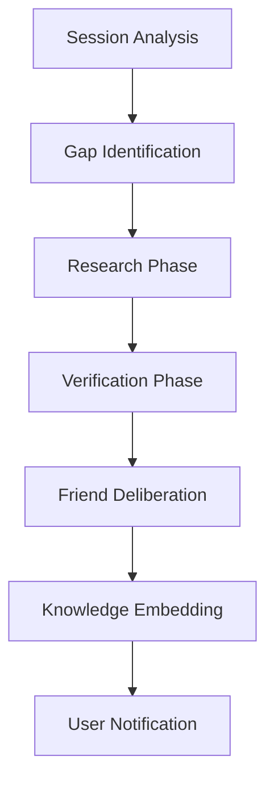

# Autonomous Learning System

Luna Chat features a sophisticated autonomous learning system that allows her to evolve her knowledge base independently by identifying gaps in her understanding, researching them, and verifying findings before integrating them into her long-term memory.

## Architecture Overview

The system operates as a multi-stage pipeline orchestrated by the `AutonomousLearningOrchestrator`. This process typically runs as a daily background job but can be triggered manually.

### 1. Session Analysis (`SessionAnalyzer`)
*   **Purpose**: To identify what Luna *doesn't* know based on recent interactions.
*   **Process**: Analyzes up to 90 days of chat history.
*   **Model**: **Groq (Llama-3.3-70b-versatile)**.
*   **Outputs**: A list of "Knowledge Gaps" with priority scores, categories (technical, academic, etc.), and suggested search queries.

### 2. Research Phase (`ResearchCoordinator`)
*   **Purpose**: To gather information from external sources to fill identified gaps.
*   **Process**: Executes the suggested queries via the search capability, aggregating data from multiple web sources.
*   **Trust Scoring**: The `SourceTrustService` evaluates the credibility of each source based on domain authority and historical accuracy.

### 3. Verification Phase (`KnowledgeVerifier`)
*   **Purpose**: To ensure the accuracy and consistency of researched information before it becomes "truth."
*   **Process**: Checks for internal consistency, plausibility, and source agreement.
*   **Model**: **Ollama (Qwen2.5:7b)** running locally.
*   **Threshold**: Requires an average source trust score of at least **0.8** to pass.

### 4. Friend Deliberation (`FriendService`)
*   **Purpose**: To gain diverse perspectives on the new knowledge.
*   **Process**: Luna starts an internal discussion between her "Friend" personas (Polaris, Aurora, Vega, Sol).
*   **Benefit**: This adds emotional intelligence (Aurora) and strategic context (Polaris) to raw factual data.

### 5. Knowledge Embedding (`KnowledgeEmbedder`)
*   **Purpose**: To integrate verified knowledge into the graph-based memory system.
*   **Process**: The knowledge is vectorized using the `EmbeddingService` and stored in `MemoryCore`.
*   **Structure**: Uses a Directed Acyclic Graph (DAG) for project execution and complex dependencies.

---

## Models Used

Luna utilizes a "Router-First" architecture to balance cost, speed, and reasoning capability.

| Component | Model | Tier | Purpose |
|-----------|-------|------|---------|
| **Router** | Llama-3.1-8b (Groq) | Nano | Intent classification and routing |
| **Session Analysis** | Llama-3.3-70b (Groq) | Pro | Identifying complex knowledge gaps |
| **Verification** | Qwen-2.5-7b (Ollama) | Local | Private, local fact-checking |
| **Council** | Claude-3.5-Sonnet / GPT-4o | Pro | High-level reasoning and deliberation |
| **Complex Tasks** | Claude Code (Sanhedrin) | Agent | Multi-agent coordination and execution |

---

## Key Concepts

### Local-First Learning
While Luna can use cloud models for heavy lifting (like analysis), she prioritizes local models (Ollama) for verification and sensitive processing. This ensures that the core "truth" of her memory is processed privately when possible.

### Source Trust Evolution
Trust is not static. The `SourceTrustService` maintains dynamic scores:
*   **Initial Trust**: Based on domain reputation.
*   **Decay**: Trust scores slowly normalize over time without reinforcement.
*   **Reinforcement**: Verified accurate facts increase trust; verified errors decrease it significantly.

### Circuit Breakers
To prevent "hallucination loops," the system includes:
*   **Spin Detection**: Prevents the Council from repeating the same actions indefinitely.
*   **Approval Gates**: High-risk or irreversible actions (like modifying system files) require explicit user approval via the `ApprovalClassifier`.

## Implementation Details

The core logic resides in:
*   `src/autonomous/autonomous-learning.orchestrator.ts`: The main pipeline logic.
*   `src/autonomous/session-analyzer.service.ts`: Groq-powered gap detection.
*   `src/autonomous/knowledge-verifier.service.ts`: Ollama-powered fact-checking.
*   `src/memory/memory.service.ts`: Integration with the graph-based memory system.
